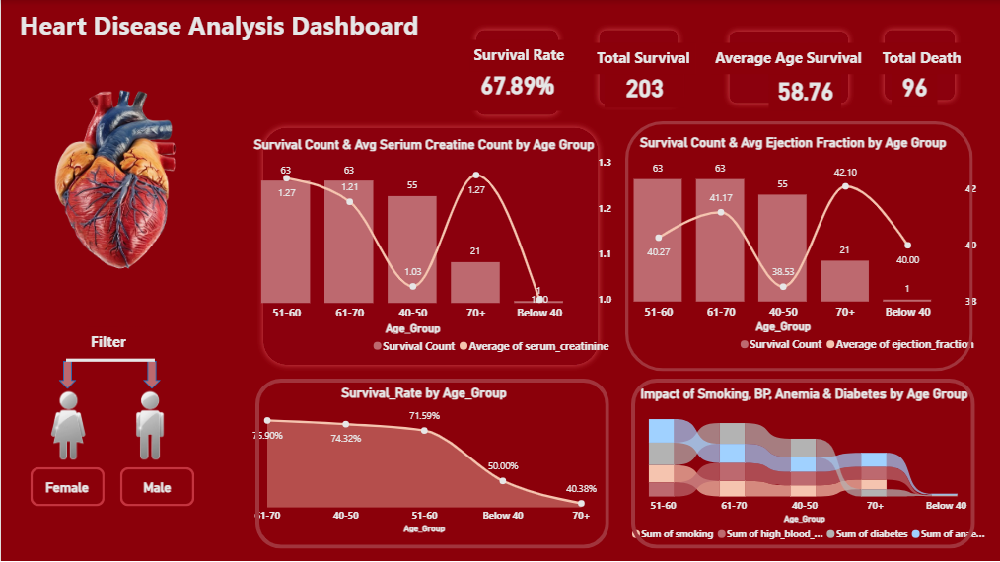

# ❤️ Heart Disease Analysis Dashboard (Power BI)

## 📌 Project Overview
This Power BI project provides a detailed analysis of heart disease data.  
The dashboard highlights key trends, risk factors, and patterns to help identify insights for healthcare analytics and decision-making.

## 📊 Features
- Patient demographics analysis (age, gender, etc.)
- Key medical attributes (cholesterol, blood pressure, chest pain types, etc.)
- Risk factor distribution
- Survival and disease occurrence patterns
- Interactive slicers & filters for deep-dive analysis

## 🛠️ Tools & Technologies
-Power BI Desktop
DAX (Data Analysis Expressions) for KPIs & calculations
Excel as the data source

## 📷 Dashboard Preview

## 🚀 How to Use
1. Clone/download this repository
2. Open `Heart Disease Analysis.pbix` using Power BI Desktop
3. Explore the visualizations & apply filters

## 📌 Insights
- Identify high-risk groups based on key health parameters  
- Compare risk factors across gender and age  
- Understand the distribution of patients with and without heart disease  

## 🔗 Author
- Created by **[Girish Kumar V]**
- 📧 Contact: [girishaquarius@gmail.com]

---
⭐ If you find this useful, consider giving this repo a star!
